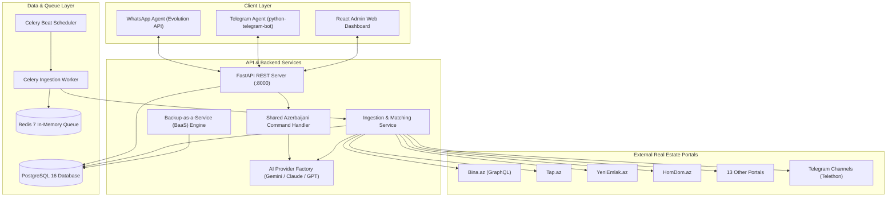

# 🏢 AI Real Estate Agent SaaS — Complete Technical Documentation

Welcome to the technical documentation for the **AI Real Estate Agent SaaS Platform**, a production-grade multi-tenant platform built for real estate agents and agencies in Azerbaijan.

---

## 📐 1. System Architecture



---

## 🌐 2. Real Estate Portal Scrapers & Crawlers

The ingestion engine features **17 dedicated website crawlers** + **1 Telethon Telegram Channel Crawler**:

1. **`BinaAzScraper`** (`bina.az`): Queries Bina.az's GraphQL API (`SearchItems`) extracting listing fields, Kupçalı (Bill of Sale), İpotekalı (State Mortgage), and company metadata.
2. **`TapAzScraper`** (`tap.az`): Scrapes apartments and commercial property listings.
3. **`YeniEmlakAzScraper`** (`yeniemlak.az`)
4. **`EvOnlineAzScraper`** (`evonline.az`)
5. **`Ev10AzScraper`** (`ev10.az`)
6. **`VipEmlakAzScraper`** (`vipemlak.az`)
7. **`OfisAzScraper`** (`ofis.az`)
8. **`KubAzScraper`** (`kub.az`)
9. **`LalafoAzScraper`** (`lalafo.az`)
10. **`HomDomAzScraper`** (`homdom.az`): AJAX paginator (`homdom.dynamicPageInfinity`) & HTML parser.
11. **`RahatEmlakAzScraper`** (`rahatemlak.az`)
12. **`UnvanAzScraper`** (`unvan.az`)
13. **`IpotekaAzScraper`** (`ipoteka.az`): Specialized in Kupçalı & İpotekalı properties.
14. **`BinamAzScraper`** (`binam.az`)
15. **`BinalarAzScraper`** (`binalar.az`)
16. **`MulkAzScraper`** (`mulk.az`)
17. **`VillaAzScraper`** (`villa.az`): Specialized in villas, country houses & land.
18. **`TelegramChannelScraper`**: Telethon crawler for monitoring public channels (e.g. `@baki_emlak_elanlari`).

### Direct Owner ("Sahibindən") & AI Makler Classification Algorithm
Listing items are categorized into **`owner`** (Ev Sahibindən) vs **`agency`** (Vasitəçi) using 4 combined layers:
1. **GraphQL Metadata**: Checks if `company` object is `null` on portals like Bina.az.
2. **Search Parameters**: Direct queries to owner URLs (e.g. `seller_type=owner`).
3. **First-Posting History Analysis (`is_first_posting`)**: Checks if the exact same property (matching district, room count, area +/- 3sqm, and price +/- 5%) was posted earlier by another user or agency. If an earlier posting exists, links `earlier_posting_url` and elevates `makler_score`.
4. **Natural Language Keyword & Phone Graph**: Scans titles/descriptions for Azerbaijani owner keywords (`"sahibindən"`, `"mülkiyyətçidən"`, `"öz evimdir"`, `"vasitəçisiz"`) and flags numbers posting 3+ listings.

---

## 🚀 3. Top 6 Market-Dominating Killer Features

1. **AI Makler Detector & First-Posting Analyzer** (`app/services/makler_detector.py`): Detects disguised realtors and flags whether a listing is the 1st original posting or a duplicate post.
2. **30-Second Speed-Dial & Urgent Alerts**: Embeds 1-tap `📞 Zəng et` speed-dial links inside WhatsApp and Telegram notifications.
3. **AI Automated Valuation Engine (AVM) & Bargain Finder** (`app/services/avm_engine.py`): Computes live district average price/$m^2$ and flags deals tagged 🔥 `TƏCİLİ FÜRSƏT ELAN! (-15% Below District Market Rate)`.
4. **Private Agent B2B Co-Brokering Network** (`app/services/b2b_service.py`): Safely matches Agent A's buyer criteria with Agent B's exclusive listing for 50/50 commission co-brokering (`B2B Qəbul et`).
5. **1-Click AI Instagram Carousel & PDF Brochure Generator** (`app/services/brochure_generator.py`): Generates branded PDF property brochures and Azerbaijani social media captions (`Broşur <id>`).
6. **AI Client Qualification Intake Bot** (`app/api/v1/client_intake.py`): Public intake endpoint (`POST /api/v1/client-intake/{tenant_id}`) for agents' Instagram bios and WhatsApp links.

---

## 🤖 3. AI Provider Abstraction Layer

The platform features an abstract multi-model LLM provider layer (`app/ai/factory.py`):

- **Supported Models**:
  - **Google Gemini**: `gemini-2.5-flash` (Default), `gemini-1.5-pro`
  - **Anthropic Claude**: `claude-3-5-sonnet-20241022`
  - **OpenAI GPT**: `gpt-4o`, `gpt-4o-mini`
- **Security**: Tenant API keys are symmetrically encrypted using Fernet AES keys (`encrypt_key` / `decrypt_key`).
- **Tasks**:
  - `criteria_parsing`: Parses unstructured Azerbaijani text (*"Yasamalda 3 otaqlı 100-150 min AZN ev sahibindən"*) into structured `StructuredCriteria` objects.
  - `match_scoring`: Evaluates listing compatibility (0.0 to 1.0 score).

---

## 💬 4. WhatsApp & Telegram Bot Command Reference

The agent command handler (`app/bot/command_handler.py`) supports full Azerbaijani conversational interaction:

| Command Group | Azerbaijani Triggers | Slash / Number Shortcuts | Function |
| :--- | :--- | :--- | :--- |
| **Kömək** | `Kömək`, `Menyu`, `Komek` | `/help`, `menu` | Displays the help menu & command list |
| **Axtarışlarım** | `Axtarışlarım`, `Axtarislarim` | `/list`, `1` | Shows all saved client property searches |
| **Yeni axtarış** | `Yeni axtarış <text>`, *Direct text* | `/add <text>`, `2` | Parses text with AI and creates a new search |
| **Kanalı dəyiş** | `Kanalı dəyiş` | `/channel`, `3` | Toggles notification route between **WhatsApp ↔ Telegram** |
| **Planım nə vaxt bitir?**| `Planım nə vaxt bitir?` | `/status`, `4` | Shows current plan, status, and expiration date |
| **Dayandır & Aktiv et**| `Dayandır <id>`, `Aktiv et <id>` | `/pause <id>`, `/resume <id>` | Pauses matching on a search or resumes it |
| **Sil** | `Sil <id>` | `/delete <id>`, `7` | Deletes an old search |
| **Reactions** | `Maraqlanıram`, `Keç`, `Satılıb` | Reaction buttons | Saves lead, skips listing, or flags property as sold |

---

## 💳 5. Subscription Plans & Backup-as-a-Service (BaaS)

### Subscription Tiers
- 🆓 **Free Trial**: 3 days, 1 saved search, instant alerts.
- 🚀 **Starter**: 5 saved searches, instant WhatsApp/Telegram alerts.
- ⚡ **Pro**: 15 saved searches, instant alerts, digest mode, **BaaS Backup Enabled**.
- 🏢 **Agency**: Unlimited searches, multi-seat, **BaaS Daily Backup Enabled**.

### Automated BaaS Backup Engine (`app/services/backup.py`)
- **Database Snapshots**: Compressed `.sql.gz` / `.db.gz` backups with 30-day retention rotation.
- **Tenant Plan Backups**: Exports tenant searches, matches, and leads to `tenant_{id}_backup_{timestamp}.json.gz`.
- **Frequencies**: Daily (1 day), Weekly (7 days), Monthly (30 days).

---

## 🖥️ 6. Admin Web Dashboard

Built with **React 18 + TypeScript + Vite + Tailwind CSS**:

1. **Dashboard Overview**: Active agents, total scraped listings, delivered matches, revenue stats.
2. **Tenant Management**: Create/edit agents, change plans, toggle BaaS backups, activate/suspend.
3. **Payments Tracker**: Offline cash payment logger & auto-expiration calculator.
4. **AI Provider Config**: Configure LLMs per task, test latency, view AI call logs.
5. **Runtime App Settings**: Live `app_name` & support contacts editor.
6. **Scraper Health**: Real-time status monitor across all 17 sources.

---

## 🚀 7. Production Deployment Guide

### Prerequisites
- Docker & Docker Compose
- Domain with SSL certificate (for webhooks & dashboard)

### Step-by-step Setup
```bash
# 1. Clone repository
git clone https://github.com/Elnur690/ai-real-estate-agent.git
cd ai-real-estate-agent

# 2. Environment Configuration
cp .env.example backend/.env
# Edit backend/.env and provide TELEGRAM_BOT_TOKEN, SECRET_KEY, GEMINI_API_KEY

# 3. Launch Container Stack
docker-compose up --build -d

# 4. Access Services
# Admin Dashboard: http://localhost:3000
# FastAPI Swagger Docs: http://localhost:8000/docs
```

---

## 📄 8. REST API Endpoint Reference

### Authentication (`/api/v1/auth`)
- `POST /api/v1/auth/setup-admin`: Create initial superadmin.
- `POST /api/v1/auth/login`: Authenticate and receive JWT Bearer token.
- `GET /api/v1/auth/me`: Get current authenticated user profile.

### Tenants (`/api/v1/tenants`)
- `GET /api/v1/tenants`: List all tenants.
- `POST /api/v1/tenants`: Create new tenant.
- `PATCH /api/v1/tenants/{id}`: Update tenant plan/status/BaaS options.
- `POST /api/v1/tenants/{id}/backup`: Trigger manual tenant BaaS data backup.

### App Settings & System Backups (`/api/v1/settings`)
- `GET /api/v1/settings`: Fetch runtime application settings.
- `POST /api/v1/settings`: Update application settings.
- `GET /api/v1/settings/backups`: List system database backups.
- `POST /api/v1/settings/backups`: Trigger instant database backup snapshot.
